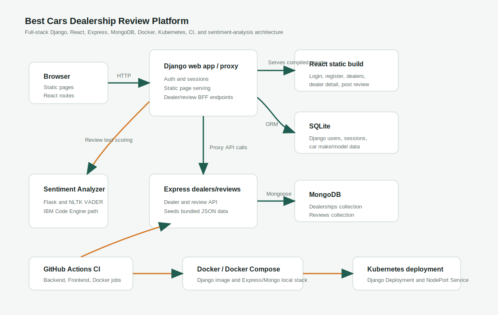

# Best Cars Dealership Review Platform

Full-stack dealership review platform with Django, React, Express, MongoDB, Docker, Kubernetes, GitHub Actions, and IBM Code Engine sentiment analysis.

Best Cars is a completed full-stack portfolio project built from the IBM Full Stack Developer Capstone structure. It lets visitors browse dealerships, filter by state, inspect dealer-specific reviews, register or log in with Django session authentication, and submit dealership reviews that are enriched with sentiment analysis.

The repository keeps its course history visible while presenting the finished system as a practical dealership review application. It does not currently claim a public production deployment.

## Overview

Best Cars combines a Django web application, a React frontend, an Express/MongoDB data service, and a separate sentiment analyzer service. Django serves the public pages, hosts authentication, stores local car make/model data, and acts as a backend-for-frontend proxy to the dealer/review service. React powers the dynamic dealership directory, dealer detail, review submission, login, and registration flows.

## Why This Project Matters

Car shoppers often need more than inventory. They need trust signals, location context, and customer feedback before visiting a showroom. Best Cars models that workflow with a service-oriented architecture that separates web delivery, authentication, dealer/review data, and AI sentiment analysis.

For a portfolio, it demonstrates full-stack ownership across UI polish, backend integration, data modeling, authentication, containerization, CI, and cloud-ready deployment artifacts.

## Highlights

- Django web app with session authentication and server-rendered static pages.
- React dynamic pages for dealers, dealer details, review submission, login, and registration.
- Express API backed by MongoDB for dealership and review data.
- Django proxy endpoints that keep the browser-facing API stable.
- Sentiment analyzer integration with a neutral fallback when the service is unavailable.
- SQLite-backed Django users and car make/model reference data.
- Docker artifacts for Django and the Express/Mongo service.
- Kubernetes deployment manifest for the Django app.
- GitHub Actions workflow with Backend, Frontend, and Docker image jobs.
- Portfolio visual polish using Bootstrap and custom CSS.

## Demo Gallery

Screenshots can be added after running the local demo.

| Screen | Expected path |
| --- | --- |
| Home | `docs/screenshots/home.png` |
| Dealers | `docs/screenshots/dealers.png` |
| Dealer detail | `docs/screenshots/dealer-detail.png` |
| Post review | `docs/screenshots/post-review.png` |
| Login | `docs/screenshots/login.png` |
| About | `docs/screenshots/about.png` |

## Architecture



The architecture diagram shows the runtime relationship between the browser, Django web app/proxy, React static build, SQLite, Express/MongoDB service, IBM Code Engine sentiment analyzer, GitHub Actions, and Docker/Kubernetes deployment artifacts.

Additional documentation:

- [API reference](docs/api-reference.md)
- [Deployment notes](docs/deployment.md)
- [Engineering decisions](docs/engineering-decisions.md)

## Tech Stack

**Backend**

- Python
- Django
- Django authentication and session middleware
- Django REST-style JSON views used by React
- Gunicorn for containerized serving

**Frontend**

- React
- Create React App
- Bootstrap
- Custom CSS visual system
- Django-served static pages

**Data**

- SQLite for Django users, sessions, and car make/model reference data
- MongoDB for dealerships and dealership reviews
- Mongoose models in the Express service

**AI Service**

- Flask sentiment analyzer
- NLTK VADER sentiment scoring
- IBM Code Engine-compatible microservice deployment path

**DevOps**

- Docker
- Docker Compose for Express/MongoDB local service orchestration
- Kubernetes `deployment.yaml`
- GitHub Actions CI

## Implemented Features

- Public Home, About, and Contact pages served by Django.
- Consistent Best Cars branding across static and React pages.
- User registration, login, logout, and session-aware navigation.
- Dealer directory with state filtering and client-side search.
- Dealer detail pages with reviews and sentiment labels.
- Authenticated review submission flow.
- Car make/model data served from Django models.
- Django proxy endpoints for dealer list, dealer detail, reviews, and review creation.
- Express endpoints for dealership and review persistence.
- MongoDB seed loading from bundled dealer/review JSON data.
- Sentiment analysis for review text through a separate service.
- Docker and Kubernetes artifacts for deployment readiness.
- CI workflow for backend checks, frontend build, and Docker image build.

## Local Setup

Use these commands from the repository root. PowerShell examples assume Windows, but the same folders and commands map cleanly to macOS/Linux shells.

Install and build the React frontend:

```powershell
cd server/frontend
npm install
npm run build
```

Create and prepare the Django environment:

```powershell
cd ..
py -3.11 -m venv .venv
.\.venv\Scripts\Activate.ps1
python -m pip install --upgrade pip
pip install -r requirements.txt
python manage.py migrate
```

Create `server/djangoapp/.env` for local service URLs:

```text
backend_url=http://localhost:3030
sentiment_analyzer_url=http://localhost:5050
```

## Running Express/Mongo Service

The Express service lives in `server/database` and listens on port `3030`. It expects MongoDB at `mongo_db:27017` when run through Docker Compose.

```powershell
cd server/database
npm install
docker build -t nodeapp .
docker compose up -d
```

The service seeds MongoDB from bundled dealership and review JSON files when it starts.

## Running Django App

After building React and starting the supporting services:

```powershell
cd server
.\.venv\Scripts\Activate.ps1
python manage.py runserver
```

Open:

- `http://127.0.0.1:8000/`
- `http://127.0.0.1:8000/about`
- `http://127.0.0.1:8000/contact`
- `http://127.0.0.1:8000/login`
- `http://127.0.0.1:8000/register`
- `http://127.0.0.1:8000/dealers`

If the sentiment analyzer is not running, dealer review pages still load and use the neutral fallback.

## Running React Build

Django serves the compiled React build from `server/frontend/build`. Rebuild it after React changes:

```powershell
cd server/frontend
npm run build
```

For frontend-only local development, `npm start` can run the Create React App dev server, but the integrated app flow is served through Django.

## Docker Usage

Build the Django app image from the repository root:

```powershell
docker build -t dealership ./server
```

Run the Django container locally:

```powershell
docker run --rm -p 8001:8000 dealership
```

The Express/Mongo service uses `server/database/docker-compose.yml` and the `nodeapp` image described above.

## Kubernetes Deployment Notes

The Kubernetes manifest is at `server/deployment.yaml`. It defines:

- A single-replica Django Deployment named `dealership`.
- A NodePort Service exposing port `8000`.
- A placeholder image: `us.icr.io/YOUR_NAMESPACE/dealership:latest`.

Before applying it, replace `YOUR_NAMESPACE` with the correct IBM Cloud Container Registry namespace and confirm runtime environment variables/host settings for the target cloud.

## GitHub Actions CI Notes

The workflow is defined at `.github/workflows/main.yml` and runs on pushes to `main`, pull requests targeting `main`, and manual dispatches.

Jobs:

- **Backend**: installs Python dependencies, runs focused flake8 checks, runs `python manage.py check`, and applies migrations.
- **Frontend**: installs frontend dependencies and runs `npm run build`.
- **Docker image**: rebuilds the React frontend and builds the Django Docker image.

The workflow validates build readiness. It does not currently push images or deploy to a public environment.

## API Endpoints Summary

See [docs/api-reference.md](docs/api-reference.md) for request and response examples.

Key browser-facing Django endpoints:

- `POST /djangoapp/register`
- `POST /djangoapp/login`
- `GET /djangoapp/logout`
- `GET /djangoapp/get_cars`
- `GET /djangoapp/get_dealers`
- `GET /djangoapp/get_dealers/<state>`
- `GET /djangoapp/dealer/<dealer_id>`
- `GET /djangoapp/reviews/dealer/<dealer_id>`
- `POST /djangoapp/add_review`

Supporting service endpoints:

- `GET /fetchDealers`
- `GET /fetchDealers/:state`
- `GET /fetchDealer/:id`
- `GET /fetchReviews`
- `GET /fetchReviews/dealer/:id`
- `POST /insert_review`
- `GET /analyze/<input_txt>`

## Engineering Decisions Summary

See [docs/engineering-decisions.md](docs/engineering-decisions.md) for details.

Core decisions:

- Django acts as the web app and backend-for-frontend proxy.
- Express and MongoDB own dealer/review data.
- SQLite remains the lightweight Django store for auth and car reference data.
- Sentiment analysis is isolated as a separate microservice.
- Session authentication is retained to match the Django app flow and capstone constraints.
- CI is split into Backend, Frontend, and Docker jobs to reflect real ownership boundaries.

## Known Limitations

- No public production URL is claimed in this repository.
- Local setup expects separate Django, Express/MongoDB, and sentiment analyzer services unless fully containerized.
- The Django Kubernetes manifest currently covers the Django app only; production-grade multi-service orchestration would need more manifests and secrets/config maps.
- The sentiment analyzer uses a simple VADER-based positive/neutral/negative classification.
- Dealer/review pagination and advanced search are not implemented.
- Some CI warnings may come from upstream Create React App or Bootstrap tooling.

## Future Improvements

- Add committed screenshots after running a polished local demo.
- Add pagination and sorting for large dealer/review datasets.
- Add stronger form validation and accessible error summaries.
- Add production-grade configuration for static assets, allowed hosts, CORS, secrets, and service URLs.
- Add full Kubernetes manifests for Django, Express, MongoDB, and the sentiment analyzer.
- Add image publishing and deployment steps to CI/CD.
- Add automated integration tests for auth, dealer search, review submission, and sentiment fallback.

## Resume Bullets

- Built a full-stack dealership review platform with Django, React, Express, MongoDB, and a Flask sentiment-analysis microservice.
- Implemented Django session authentication, React review workflows, and backend-for-frontend proxy endpoints for dealer/review data.
- Containerized app components with Docker and documented Kubernetes deployment readiness for IBM Cloud-style hosting.
- Added GitHub Actions CI jobs for backend checks, frontend production build, and Docker image validation.
- Integrated sentiment scoring for customer reviews with resilient fallback behavior when the AI service is unavailable.
